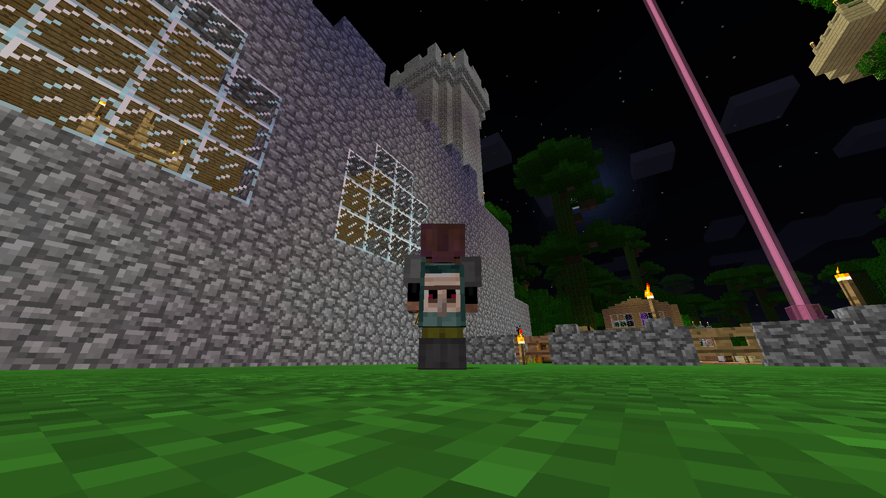

Yup. That's my old Minecraft character with the Minecon 2015 cape in the world with ugly things.

So I went to Minecon. If you don't know, Minecon is a conference for the videogame Minecraft. If you're reading this you probably know Minecraft, it's a game with blocks you can place and destroy - sortof. I like it to call it handchoppingtrees-RPG-sandbox-thing-PvP-game.

It was made [by](http://minecraft.gamepedia.com/Notch) [a](https://en.wikipedia.org/wiki/Markus_Persson) [guy](http://notch.tumblr.com/archive) [called](http://twitter.com/notch) [Notch](http://notch.net). He started to make this game in his attic and it gained traction. Now, there are millions of players playing it worldwide on dozens of platforms. The PC version alone has been sold over [20 million times](https://minecraft.net/stats), making it the best-sold game of the world right now.

He started working on it in 2009, stopped in late 2011, and he sold his company [Mojang](https://mojang.com/) for 2.5$ billion in november 2014.

And I don't see anything comming from him. Which I don't like, because I really liked it when he did. Not just Minecraft, but his [Ludum Dare](http://ludumdare.com/autho/notch) games were really neat too. He often streamed stuff, which is nice to "watch" when you're doing something.

But now that's gone. He said Minecraft consumed him for a long time and he wanted to get rid of it I guess. Then he bought a super huge expensive house and then I never heard of him except for funny tweets.

He seemed like a good dude to talk with and like a true indie developer. The story of how Minecraft happened and him is really interesting either. I took a lot inspiration from him, too. And that's why I miss him a little.

Oh, and I _love_ Minecraft. I remember it playing it for the first time. I don't know what time it was, but I was young. It was alpha. I think > 1. I was probably 10-11. I was at a girlfriend and she demonstrated me. The world was an ocean, except for a little island with a few trees. I didn't really have the spatial perception, so I half-cut down a tree without me realising it. Then we mined without a pickaxe down. It was wonderful how satisfied we were. Then we visited the [minecraftwiki](http://minecraftwiki.net) and we saw we could make torches. It was like :scream:

Then we went to her brother who had a huge world. It was very pretty and complex. He had built a lot. I was astonished.

I came home, he gave me his cracked hax client pirate thing, I played it. I made a tunnel with my hands trough a mountain. I remember a vague creature standing in the tunnel shooting strange things at me. I was never been so scared in a video game. I thought the game was bugged and glitched. Turns out it was a skeleton, I didn't have the game mode at peacefull since I didn't know they had it on and I didn't know this would happen and such.

I got a Michael Jackson CD arround christmas. I just went playing Minecraft with it on. Hating school, exploring Minecraft, loving Minecraft. Just having a wondeful time in my dark tiny room without knowing such a thing as coding.

A friend of mine discovered it too. We build wonderful things with it. I can remember he hadn't played survival mode and he build a pig farm thing with redstone, it was such an amazing thing. I don't know what we all build togheter, but it was many.

Most of the worlds went missing. Mostly due to ragequitting when not knowing what to do. The amount of lost data is incredible. I can't describe it.

There is so much to tell about how awesome Minecraft was - and is - to me and my friends.

So I heard this year's Minecon was in London. I grabbed my chance. I wanted to experience it, no matter it was fun or stupid. I hoped to see some game developers and speak to them. That worked out pretty well.

It was a very strange experience. I really liked it, but sometimes I didn't. But that makes it special, and more fun.
 I especially liked the indie developers' panels and games. You could talk to them and ask questions, and play their games and give feedback. They probably went home just wanting to work a week on their games. The "live show" was some great entertainment I never experienced before. At the beginning I was like "We're here to Minecraft not for people dancing on Lady Gaga" but then I was like ":open_mouth: woooooooww sooo much fireeee :fire::zap:"
Everyone was nice, but I was I think a little too tired or something to experience minecon at it's best, to really have a conference feeling. That's why I liked the devs the most, I could talk to them.

There were a lot of kids, and there were a lot of lines. And long ones. I remember the meet & greet line was 3,5 hours, if not longer. There was also free stuff. With huge lines. I remember a game where you needed to shoot with a bow and arrow at a target. You had 3 chances, if you hit the target, you got a free minecraft foam pickaxe. The line was huge. Sure, I like a pickaxe too, but there's much more to experience at minecon!

I found it funny that almost all people were white. There were more boys then girls, but still quite a few girls. Oh and Notch wasn't there, but I can find myself in that desicion.

I enjoyed it. I don't know minecon was the best conference I would like, but hey, I experienced it and it was a load of fun and I learned a lot.